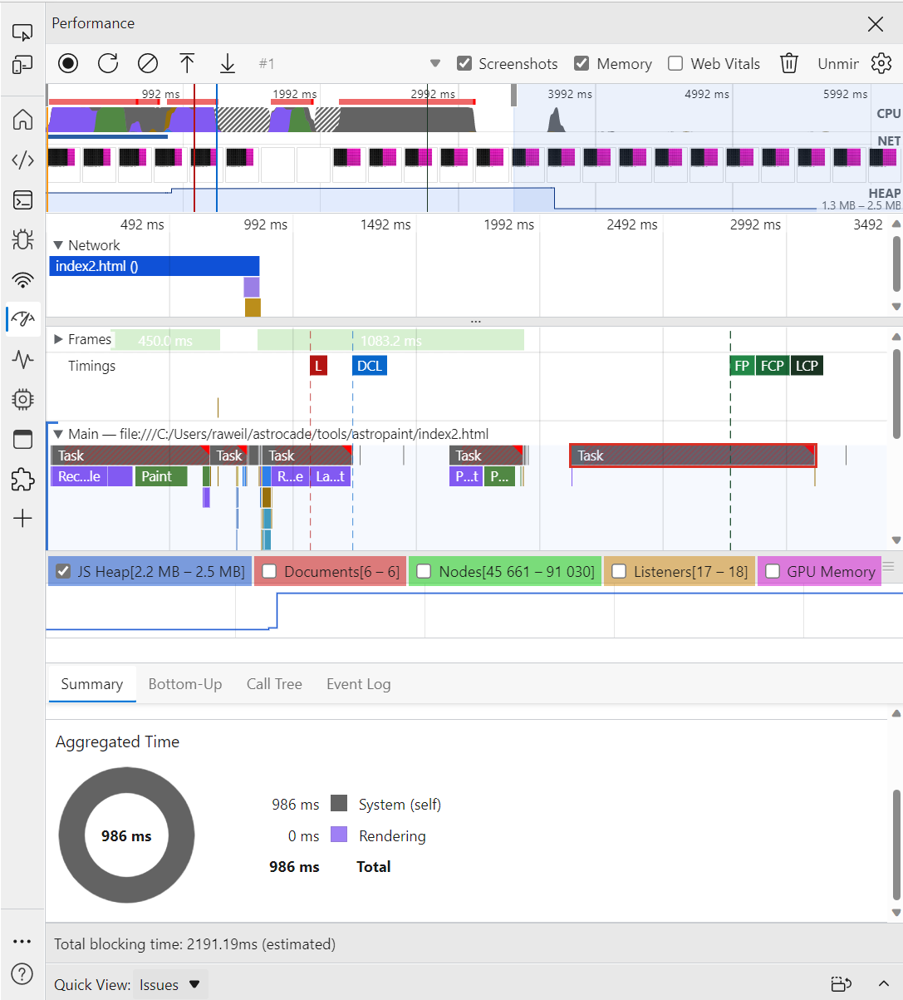

A small and *intentionally poorly-performant* demo used for investigating some behavior in the Performance panel in DevTools.

On page load, a grid of 16,320 square `div`s is drawn to the screen: half are black, half are pink. Pressing the left and right arrow keys recolors these "pixels" by adding and removing CSS classes four columns at a time. This causes lots of screen repainting.

No local server needed; just open `index.html` in the browser straight away.

